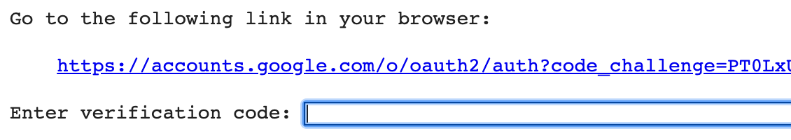

# 구글 Colaboratory에서 예제 실행하기
이 책의 예제는 [제이펍 - 머신러닝 도감](http://bit.ly/2rXasjl)에 접속해 구글 Colaboratory에서도 실행해볼 수 있습니다. 여기에서는 예제를 실행하는 방법과 이미지 파일을 불러들여 실행하는 방법을 설명합니다. 해당 링크 접속 전 가능하면 구글 계정으로 로그인하기 바랍니다. 구글 계정이 없는 분은 회원 가입하기 바랍니다.

## 예제 실행 방법
[제이펍 - 머신러닝 도감](http://bit.ly/2rXasjl)에 접속하면 깃허브 저장소와 똑같은 예제 파일이 등록되어 있습니다. 원하는 예제 파일을 실행한 후 오른쪽 위에 있는 '실습 모드에서 열기'를 누릅니다.


페이지를 다시 로딩하면 예제의 왼쪽 옆에 `[  ]`라는 항목을 볼 수 있습니다. 해당 부분에 마우스 커서를 이동하면 `▶︎` 형태로 모양이 바뀝니다. 이를 누르면 예제가 실행되고 결과를 확인할 수 있습니다.


전체 예제를 모두 실행한 후 결과를 확인하고 싶다면 '런타임 - 모두 실행'을 선택합니다. 약간의 시간이 지난 후 결과를 확인할 수 있습니다.


특정 예제를 빠르게 확인하고 싶다면 왼쪽의 '목차' 항목에서 원하는 예제 제목을 누르면 해당 부분으로 바로 이동할 수 있습니다.

## 구글 Colaboratory에서 이미지 파일 불러와 실행하기
ch04.ipynb에 있는 '픽셀 밝기 정보로 사용하는 숫자를 그대로 활용'이라는 예제는 이미지 파일을 불러와서 실행합니다. 주피터 노트북은 특별한 설정 없이 예제 파일을 실행할 수 있지만, 구글 Colaboratory에서는 별도의 설정을 해주어야 합니다. 여기에서는 이미지 파일을 불러오는 여러 가지 방법 중 [PyDrive](https://pythonhosted.org/PyDrive/)라는 파이썬 라이브러리를 사용합니다.

예제 앞에 다음 코드를 넣었습니다. 이는 PyDrive로 이미지 파일을 불러오는 코드입니다.

```python
!pip install -U -q PyDrive
 
from pydrive.auth import GoogleAuth
from pydrive.drive import GoogleDrive
from google.colab import auth
from oauth2client.client import GoogleCredentials 
 
# 1. Authenticate and create the PyDrive client.
auth.authenticate_user()
gauth = GoogleAuth()
gauth.credentials = GoogleCredentials.get_application_default()
drive = GoogleDrive(gauth)

file_id = '그림공유링크의파일ID'
downloaded = drive.CreateFile({'id': file_id})
downloaded.GetContentFile('zero_image.png')
```

`▶︎`을 눌러 해당 코드를 실행하면 다음과 그림과 같은 인증 창이 등장합니다(구글 계정에 로그인하지 않았다면 바로 로그인할 것인지를 묻습니다). 파일을 실행하려고 인증 코드를 요구합니다. 중간에 있는 URL을 눌러 로그인 페이지로 접속합니다.



로그인 페이지로 접속하면 여러분이 로그인한 계정 이메일 주소가 나타납니다. 여러분의 계정 이름 부분을 눌러 다음 페이지로 이동합니다.


Google Cloud SDK 계정에 접근을 허용할 것인지 묻습니다 '허용'을 눌러 접근하게 만듭니다.


인증 코드가 등장합니다. 인증 코드 오른쪽에 있는 사각형을 2개 겹친 '복사'를 누르면 인증 코드를 복사합니다.


다시 ch04.ipynb 페이지로 돌아와서 'enter verification code' 옆 입력란에 복사한 인증 코드를 붙여넣기 한 후 'enter' 키를 누릅니다.


실행 결과를 확인할 수 있습니다.

